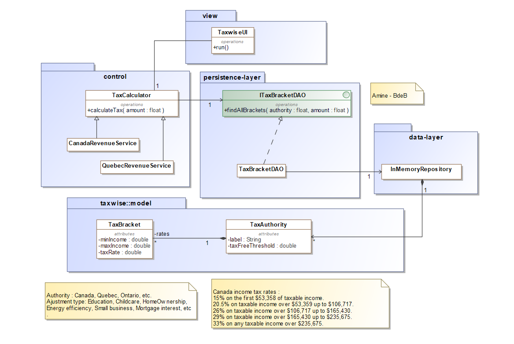

# 🧾 TaxWise – Income Tax Calculation Simulation (Python)

## 📚 Project Overview

**TaxWise** is a Python-based simulation project developed as part of an academic semester-end assignment. The application models the calculation of personal income taxes based on different tax authorities (e.g., Canada, Quebec) using tax brackets and rates. It follows a multi-layered architecture with clear separation of concerns (MVC + DAO patterns).

---

## 🛠️ Features

- Supports multiple tax authorities (Canada, Quebec, Ontario, etc.)
- Applies progressive tax brackets using predefined rules
- Modular and scalable structure based on UML-class design
- Separation of responsibilities across:
  - **Control layer**
  - **Persistence layer**
  - **Data layer**
  - **Model layer**
  - **View layer**

---

## 🧩 Architecture & Components
## 🧭 UML Architecture

The following diagram illustrates the layered architecture of the application:



### 📦 Control Layer
- `TaxCalculator`: Core logic for computing taxes using bracket data.
- `CanadaRevenueService` / `QuebecRevenueService`: Define authority-specific behaviors.

### 📦 Persistence Layer
- `ITaxBracketDAO`: Interface to access tax brackets from storage.
- `TaxBracketDAO`: Concrete DAO implementation.

### 📦 Data Layer
- `InMemoryRepository`: Simulates a data store for tax bracket entries.

### 📦 Model Layer
- `TaxBracket`: Represents a tax rate for a specific income range.
- `TaxAuthority`: Represents a regional/federal tax authority and its tax-free threshold.

### 📦 View Layer
- `TaxwiseUI`: Simple interface for running the simulation and displaying results.

---

## 🧮 Example Tax Brackets (Canada)

| Income Range | Tax Rate |
|--------------|----------|
| First $53,358 | 15% |
| $53,359 – $106,717 | 20.5% |
| $106,718 – $165,430 | 26% |
| $165,431 – $235,675 | 29% |
| Over $235,675 | 33% |

*Adjustments such as education, childcare, and energy efficiency are excluded from this basic simulation.*

---

## 🧪 How to Run

```bash
# Clone the repository
git clone https://github.com/yourusername/taxwise-simulation.git
cd taxwise-simulation

# Run the main interface
python main.py
## 📂 File Structure
taxwise/
│
├── service/
│   ├── TaxCalculator.py
│   ├── CanadaRevenueService.py
│   └── QuebecRevenueService.py
│
├── persistence/
│   ├── ITaxBracketDAO.py
│   └── TaxBracketDAO.py
│
├── data/
│   └── InMemoryRepository.py
│
├── model/
│   ├── TaxBracket.py
│   └── TaxAuthority.py
│
├── view/
│   └── TaxwiseUI.py
│
└── main.py
👨‍💻 Author
Abdirahman Abdillahi, Chaouche Hanane, Kanfoud Kmar
Academic project developed for the course Programming Language.
Contact: [aagd47@gmail.com]

##📜 License
This project is for educational and non-commercial use only.

---
